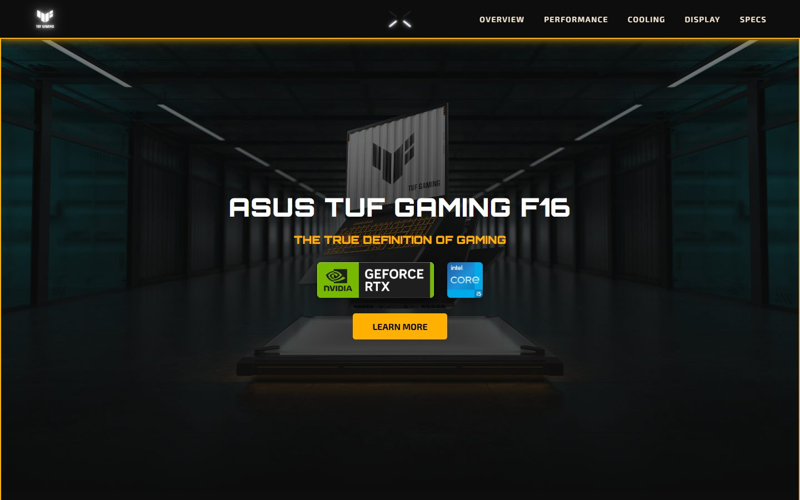
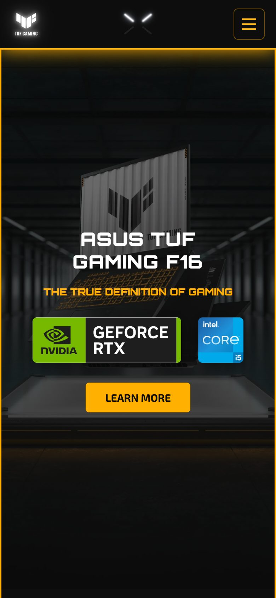

# ASUS TUF Gaming F16 — Konsept Tanıtım Sayfası

Front-end becerilerimi geliştirmek için sıfırdan tasarladığım, ASUS TUF Gaming F16 için tek sayfalık bir ürün tanıtım sitesi. Framework veya kütüphane kullanılmadı; her şey düz HTML, CSS ve JavaScript.

> Eğitim amaçlı konsept çalışmadır, ASUS ile bağlantılı değildir. Ürün adları, logolar ve görseller sahiplerine aittir.

## Canlı Demo

[celtikarda.github.io/personal-website](https://celtikarda.github.io/personal-website/)

## Ekran Görüntüleri

<p align="center">
  
  &nbsp;
  
</p>

## Öne Çıkan Özellikler

- **Responsive tasarım:** Telefon, tablet, küçük laptop ve masaüstü için ayrı kırılım noktaları. Görsel ve metin geniş ekranda yan yana, dar ekranda alt alta dizilir; yatay telefonda header incelir.
- **Mobil menü:** 1100 px altında hamburger menüye döner; Esc tuşu ya da menü dışına dokunmakla kapanır.
- **Lightbox:** Üzerinde yazı olan ürün görsellerine tıklayınca orijinal boyutunda açılır, küçük ekranda kaydırarak okunur.
- **Teknik özellikler:** İkonlu kart grid'i ve öne çıkan özellik kartları.
- **Erişilebilirlik:** `prefers-reduced-motion` desteği, klavyeyle kullanılabilen menü, `aria` etiketleri.
- **Easter egg:** Sayfada gizli bir sürpriz var. İpucu: gerçek TUF F16'daki Fn+F5 tuşu.

## Kullanılan Teknolojiler

- **HTML5** — semantik bölümler (`header`, `section`, `footer`)
- **CSS3** — Flexbox, Grid, CSS değişkenleri, `clamp()`, keyframe animasyonları, media query'ler
- **JavaScript** — framework'süz; menü, lightbox ve easter egg

## Yerelde Çalıştırma

```bash
git clone https://github.com/Celtikarda/personal-website.git
```

Klonladıktan sonra `index.html` dosyasını tarayıcıda açmanız yeterli.
